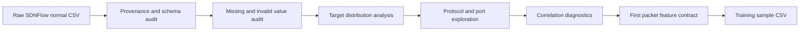

# Model Exploration and Training — Exploratory Data Analysis

<show-structure for="chapter" depth="2"/>

<p>This chapter explains the exploratory analysis that transforms the normal-traffic SDNFlow source into the compact first-packet dataset used by the classifier. The authoritative implementation is <code>SDN-MPLS-ML-TechDemonstrator-Dataset-EDA.ipynb</code>. Its purpose is not merely to inspect a CSV file. It establishes whether a prediction made at PacketIn time can be supported by variables that exist before the rest of a flow has unfolded.</p>

<p>The analysis therefore follows a deliberately restrictive question. Given only the Ethernet type, IP protocol number, source port, and destination port of the first packet, is there enough stable structure to distinguish DNS, FTP, HTTP, ICMP, NTP, SSH, and streaming traffic without borrowing information from the future of the flow.</p>

<note>
<p>The dataset originates from the SDNFlow research dataset described by Buzzio-García and colleagues. The original work records OpenFlow-derived traffic statistics for SDN traffic analysis. This project narrows that richer source to a normal-traffic, seven-class classification problem and uses only fields available from the first packet. See the <a href="https://ieeexplore.ieee.org/document/10473999/">IEEE Access dataset paper</a>.</p>
</note>

## Analytical Story {id="eda-analytical-story"}

<p>The notebook moves from provenance to trust, then from trust to interpretation. It first fixes the execution environment and hashes the input file. It then profiles all 39 columns, tests the four deployable features, studies the target imbalance, examines protocol and port structure, and finally exports a five-column training contract.</p>



<p>This progression matters because a visually convincing correlation is not sufficient evidence for deployability. A feature can be predictive and still be unusable if it is calculated after the flow completes, if it memorizes the laboratory topology, or if it reveals the target directly. The notebook encodes this distinction in its configuration, helper functions, and final column selection.</p>

## Reproducible Input Boundary {id="eda-reproducible-input-boundary"}

<p>The notebook records its runtime before touching the dataset. The stored execution used Python 3.13.13, pandas 3.0.5, NumPy 2.5.1, Matplotlib 3.11.1, seaborn 0.13.2, SciPy 1.18.0, and scikit-learn 1.9.0. The execution timestamp was <code>2026-08-03T18:56:25.186514+00:00</code>.</p>

<p>The configuration cell defines the raw input as <code>src/res/data/raw/SDNFlow_Dataset_Normal.csv</code> when the relative notebook path is resolved. Processed output is directed to <code>src/res/data/processed</code>. A random state of <code>42</code> controls reproducible sampling, expensive plots are capped at 50,000 observations, and figures are configured for optional PNG export.</p>

| Property | Executed value | Interpretation |
|---|---:|---|
| Source size | 36,914,686 bytes | The source is large enough that bounded plotting is useful |
| SHA-256 | `9b35c490b2a40e42de4151cfcdeb788be9a3cbf2f0fe8eead6f35f409fc36dfb` | Identifies the exact input used by the stored run |
| Rows | 221,564 | One observation per source record |
| Columns | 39 | Original flow, protocol, timing, volume, and label fields |
| In-memory size | 98.43 MB | Deep pandas memory estimate after loading |

<tip>
<p>The hash is the strongest provenance check in the notebook. A later run can have the same filename and shape while containing different records. Matching the SHA-256 value provides evidence that the underlying bytes are unchanged.</p>
</tip>

<p>The loader validates that the input exists, is a regular file, is not empty, contains no duplicate column names, and can be parsed as UTF-8 comma-separated data. It converts decoding, empty-file, and parser failures into errors that name the failed source. It also checks that none of the output paths resolve to the input path before loading the DataFrame.</p>

<p>The following notebook excerpt is the concrete provenance and loading boundary. The deep copy separates the working frame from the object returned by the CSV parser, while the size and digest identify the source before analysis changes any values.</p>

```python
assert DATA_PATH.exists()
assert DATA_PATH.is_file()
assert_no_output_overwrite(
    DATA_PATH,
    [TRAINING_OUTPUT_PATH, FEATURES_OUTPUT_PATH, EDA_SUMMARY_PATH],
)

source_size_bytes = DATA_PATH.stat().st_size
source_sha256 = sha256_of_file(DATA_PATH)

df_raw = pd.read_csv(
    DATA_PATH,
    encoding=CSV_ENCODING,
    sep=CSV_SEPARATOR,
)
df = df_raw.copy(deep=True)
source_memory_mb = df.memory_usage(deep=True).sum() / (1024 ** 2)
```

## First-Packet Feature Contract {id="eda-first-packet-feature-contract"}

<p>The notebook treats feature selection as a systems constraint. The classifier runs when OpenDaylight receives a PacketIn notification, so it cannot depend on completed-flow duration, byte totals, packet totals, rates, idle periods, or interval aggregates. Four integer fields satisfy the timing boundary.</p>

| Feature | Allowed range | Packet meaning | Deployment reason |
|---|---:|---|---|
| `eth_type` | 0 to 65,535 | Ethernet payload protocol identifier | Available while parsing the Ethernet header |
| `ip_proto` | 0 to 255 | IPv4 or IPv6 next-header protocol number | Separates ICMP, TCP, and UDP behavior immediately |
| `src_port` | 0 to 65,535 | Transport source port, or zero when not applicable | Captures server and ephemeral-port directionality |
| `dst_port` | 0 to 65,535 | Transport destination port, or zero when not applicable | Provides strong service evidence for known applications |

<p>The supervised target is <code>Category</code>. The expected class order is DNS, FTP, HTTP, ICMP, NTP, SSH, and STREAMING. This order later becomes the stable integer mapping used by the training notebook and inference API.</p>

<warning>
<p>The raw dataset includes many variables that could make an offline classifier stronger. Most are intentionally excluded because they depend on observations collected after the first packet. Using them would create temporal leakage, since production inference would not possess the same information at decision time.</p>
</warning>

## Utility Layer {id="eda-utility-layer"}

<p>The large utility cell makes the analysis defensive and repeatable. The following inventory covers every function implemented in that cell and the later port-analysis cell, including helpers that are present as analytical scaffolding but are not invoked by the executed path.</p>

<deflist type="full" collapsible="true">
<def title="sha256_of_file(path)">
<p>Validates that the path exists and is a file, reads it in binary chunks, and returns the hexadecimal SHA-256 digest. Chunked reading prevents the entire source file from being copied into memory solely for hashing.</p>
</def>
<def title="sanitize_values(values, limit)">
<p>Builds a compact, bounded sample of heterogeneous values for schema display. It normalizes scalar values, escapes line breaks, represents nulls safely, and stops after the configured limit so high-cardinality columns do not flood notebook output.</p>
</def>
<def title="finalize_figure(name)">
<p>Applies tight layout, sanitizes the requested filename, optionally writes a 180 DPI PNG, displays the active figure, and closes it. Closing each figure limits retained Matplotlib state during the long analysis.</p>
</def>
<def title="random_sample_frame(frame, limit)">
<p>Returns either a copy of the full DataFrame or a reproducible sample controlled by <code>RANDOM_STATE</code>. The function protects expensive plots without changing the tables and counts computed from the full dataset.</p>
</def>
<def title="normalize_text_series(series)">
<p>Converts a series to pandas nullable strings, trims surrounding whitespace, and preserves missing values. This is the common text boundary used before more specific category checks.</p>
</def>
<def title="normalize_category_series(series)">
<p>Applies text normalization, converts labels to uppercase, and maps configured textual null markers to <code>pd.NA</code>. It prevents spelling differences caused only by whitespace or case from becoming artificial classes.</p>
</def>
<def title="is_numeric_like_string(value)">
<p>Tests whether a string can be parsed as a finite number. It distinguishes a recoverable textual number from a nonnumeric token, an infinity, or an actual null.</p>
</def>
<def title="build_schema_table(frame)">
<p>Profiles every column by data type, non-null count, null count, cardinality, unique percentage, safe sample values, constant status, feature status, and target status. It sorts selected features and the target to the front of the report.</p>
</def>
<def title="classify_identifier_like(column_name, unique_percentage, unique_count, total_rows)">
<p>Flags identifier-like columns through naming signals such as <code>_id</code> and through near-total uniqueness. In the executed dataset, this correctly identifies <code>flow_ID</code>.</p>
</def>
<def title="classify_leakage_risk(column_name)">
<p>Assigns an approved, target, high, medium, or low leakage category from the column name and intended first-packet scope. The current notebook defines this policy helper but does not invoke it in an output-producing cell.</p>
</def>
<def title="cramers_v(x, y)">
<p>Builds a contingency table, applies the chi-square independence test, and calculates a bias-corrected Cramér association value. It returns both the association strength and the p-value. The function is implemented but not called by the executed notebook.</p>
</def>
<def title="prepare_top_counts(series, top_n, other_label)">
<p>Retains the most frequent categories and folds the remaining mass into an aggregate label. It is available for bounded categorical plots but is not used by the stored execution.</p>
</def>
<def title="add_audit_row(audit_rows, step, rows_before, rows_removed, reason)">
<p>Appends a structured cleaning event with before, removed, and after counts. The current export path fails on invalid selected features instead of building this audit sequence, so the helper remains unused.</p>
</def>
<def title="feature_validity_report(frame)">
<p>Creates a numeric view and detailed masks for genuine nulls, empty strings, textual null markers, numeric strings, booleans, nonnumeric strings, infinities, conversion failures, negative values, values above protocol limits, and nonintegral values. It is the central validation function used both during exploration and before export.</p>
</def>
<def title="port_bucket(series)">
<p>Uses <code>pd.cut</code> to classify ports into privileged values from 0 to 1,023, registered values from 1,024 to 49,151, and dynamic values from 49,152 to 65,535.</p>
</def>
<def title="describe_numeric_series(series)">
<p>Computes count, minimum, maximum, mean, median, standard deviation, quartiles, skewness, and kurtosis after removing nonfinite observations.</p>
</def>
<def title="assert_no_output_overwrite(data_path, output_paths)">
<p>Resolves source and destination paths and rejects any destination equal to the source. This protects the raw dataset from an accidental export overwrite.</p>
</def>
<def title="analyze_port_feature(frame, feature)">
<p>Performs the complete source-port or destination-port study. It validates inputs, coerces values, builds invalid-value masks, computes descriptive and range statistics, identifies singleton ports, applies an IQR diagnostic, and renders raw, logarithmic, box, frequency, and administrative-range plots.</p>
</def>
</deflist>

<note>
<p>The notebook imports <code>mutual_info_classif</code> and <code>LabelEncoder</code>, and defines Cramér's V and leakage helpers, but the executed cells do not call them. They should be understood as unfinished analytical extensions, not as evidence reported by this run.</p>
</note>

## Schema and Data Quality {id="eda-schema-and-data-quality"}

<p>The loaded table contains 36 numeric columns and three textual columns, <code>ipv4_src</code>, <code>ipv4_dst</code>, and <code>Category</code>. The schema report identifies <code>eth_type</code> and <code>Attack</code> as constants. It finds no columns with only one non-null value. The only high-cardinality, identifier-like field is <code>flow_ID</code>.</p>

<p>The missingness audit produces an unusually clean result. There are zero missing cells, zero rows with any missing value, zero selected-feature gaps, and zero missing targets. The textual audit also finds no empty strings, textual null markers, or whitespace-only values in the two IPv4 address columns or the target.</p>

<p>The missingness figure consequently contains no positive missing-value bars. The optional heatmap branch is not entered because the source has 39 columns and the notebook limits that visualization to datasets with fewer than 30 columns.</p>

<p>The executed audit combines the full schema profile with a feature-specific validity report. The three returned objects deliberately separate the summary shown to the analyst, the coerced numeric values used later, and the row-level masks required to reject invalid records.</p>

```python
schema_table = build_schema_table(df)
column_memory = (
    df.memory_usage(deep=True)
    .rename("memory_bytes")
    .reset_index()
    .rename(columns={"index": "column"})
)
schema_table = schema_table.merge(column_memory, on="column", how="left")

feature_summary, feature_numeric_frame, feature_detail = (
    feature_validity_report(df)
)
missing_counts = df.isna().sum().sort_values(ascending=False)
rows_with_any_missing = int(df.isna().any(axis=1).sum())
```

| Selected feature | Nulls | Empty strings | Nonnumeric strings | Infinite values | Out of range | Nonintegral | Invalid rows |
|---|---:|---:|---:|---:|---:|---:|---:|
| `eth_type` | 0 | 0 | 0 | 0 | 0 | 0 | 0 |
| `ip_proto` | 0 | 0 | 0 | 0 | 0 | 0 | 0 |
| `src_port` | 0 | 0 | 0 | 0 | 0 | 0 | 0 |
| `dst_port` | 0 | 0 | 0 | 0 | 0 | 0 | 0 |

<p>Every one of the 221,564 rows therefore remains eligible for feature-level analysis. The clean result does not remove the need for validation. It proves that the exact hashed input satisfies the contract, while the same code remains able to reject a later malformed source.</p>

```python
df_analysis = df.copy(deep=True)
df_analysis[TARGET_COLUMN] = normalize_category_series(
    df_analysis[TARGET_COLUMN]
)
for feature in FEATURE_COLUMNS:
    df_analysis[feature] = pd.to_numeric(
        df_analysis[feature],
        errors="coerce",
    )

analysis_valid_mask = df_analysis[TARGET_COLUMN].isin(EXPECTED_CLASSES)
for feature, bounds in FEATURE_RULES.items():
    analysis_valid_mask &= df_analysis[feature].notna()
    analysis_valid_mask &= np.isclose(df_analysis[feature] % 1, 0)
    analysis_valid_mask &= df_analysis[feature].between(
        bounds["min"],
        bounds["max"],
    )

df_analysis_valid = df_analysis.loc[
    analysis_valid_mask,
    TRAINING_COLUMNS,
].copy()
```

## The Target Distribution {id="eda-target-distribution"}

<p>After trimming and uppercasing <code>Category</code>, all seven expected classes are present. Their frequencies reveal that this is not a balanced classification problem.</p>

<p>The class table is calculated from the normalized target rather than the raw strings. Its count, percentage, and dense rank columns drive both the tabular result and the later interpretation of majority and minority support.</p>

```python
category_normalized = normalize_category_series(df[TARGET_COLUMN])
category_distribution = (
    category_normalized
    .value_counts(dropna=False)
    .rename_axis("Class")
    .reset_index(name="Count")
)
category_distribution["Percentage"] = (
    category_distribution["Count"] / len(df) * 100.0
)
category_distribution["Rank"] = (
    category_distribution["Count"]
    .rank(method="dense", ascending=False)
    .astype(int)
)
```

| Rank | Class | Records | Share |
|---:|---|---:|---:|
| 1 | HTTP | 164,974 | 74.458847 percent |
| 2 | DNS | 53,551 | 24.169540 percent |
| 3 | STREAMING | 1,487 | 0.671138 percent |
| 4 | SSH | 1,133 | 0.511365 percent |
| 5 | ICMP | 305 | 0.137658 percent |
| 6 | FTP | 91 | 0.041072 percent |
| 7 | NTP | 23 | 0.010381 percent |

<p>HTTP is the majority class and NTP is the minority class. Their count ratio is approximately 7,172.78 to 1. A classifier that mostly follows the two dominant classes can obtain high accuracy while failing the operationally rare classes. This finding directly motivates stratification, balanced sample weights, per-class reporting, and macro F1 in the training notebook.</p>

<p>The notebook renders the same distribution twice, first as absolute class counts and then as class percentages. The count view communicates the number of available training examples, while the percentage view makes the dominance of HTTP and DNS immediately comparable across classes.</p>

<warning>
<p>NTP has only 23 observations before any split. No evaluation statistic can overcome that evidence limit. A small change of a few predictions causes a large change in NTP recall and F1, so the class result must be reported with its support count.</p>
</warning>

## Ethernet and Network-Layer Structure {id="eda-ethernet-network-layer"}

<p>The Ethernet type distribution is degenerate. All 221,564 records use EtherType 2,048, which denotes IPv4. The notebook confirms <code>Solo IPv4 2048 presente: True</code>. The field remains in the deployment contract because PacketIn parsing supports it, but this dataset provides no variation from which the model can learn an Ethernet-type split.</p>

| IP protocol | Label | Records | Share |
|---:|---|---:|---:|
| 6 | TCP | 166,475 | 75.136304 percent |
| 17 | UDP | 54,784 | 24.726039 percent |
| 1 | ICMP | 305 | 0.137658 percent |

<p>The protocol-by-class cross-tabulation clarifies why <code>ip_proto</code> is useful. Every ICMP record uses protocol 1. TCP is dominated by HTTP and also carries FTP, SSH, and some streaming records. UDP is dominated by DNS and also contains NTP and streaming traffic. Protocol number therefore acts as a coarse partition, while ports provide finer service evidence inside TCP and UDP.</p>

<p>Frequency charts accompany both EtherType and IP protocol tables. A normalized class-by-protocol heatmap then presents class composition within each protocol, alongside the numeric cross-tabulation used to verify the plotted proportions.</p>

```python
proto_by_class = pd.crosstab(
    df_analysis_valid["ip_proto"],
    df_analysis_valid[TARGET_COLUMN],
    normalize="index",
)

plt.figure(figsize=(10, 6))
sns.heatmap(proto_by_class, annot=True, fmt=".2f", cmap="mako")
plt.xlabel("Category")
plt.ylabel("ip_proto")
finalize_figure("11_ip_proto_heatmap")
```

<tip>
<p>A protocol number is categorical even though it is stored as an integer. The distance between TCP value 6 and UDP value 17 has no physical meaning. Tree models are suitable here because they can partition values without assuming that numeric distance is a linear measure of protocol similarity.</p>
</tip>

## Port Structure {id="eda-port-structure"}

<p>Source and destination ports are valid integers throughout the dataset. The analysis keeps port zero because ICMP has no TCP or UDP port and the project represents that absence with zero. The IQR check is diagnostic only. A rare or numerically distant port is not automatically erroneous because port numbers are identifiers rather than continuous measurements.</p>

| Statistic | `src_port` | `dst_port` |
|---|---:|---:|
| Count | 221,564 | 221,564 |
| Minimum | 0 | 0 |
| Maximum | 60,999 | 60,999 |
| Mean | 23,283.625 | 23,806.910 |
| Median | 443 | 33,076 |
| Standard deviation | 23,922.476 | 23,929.102 |
| Unique values | 22,369 | 21,964 |
| Values appearing once | 6,397 | 5,823 |
| Port zero records | 305 | 305 |
| Privileged range records | 111,604 | 108,760 |
| Registered range records | 64,691 | 66,595 |
| Dynamic range records | 45,269 | 46,209 |
| IQR outliers | 0 | 0 |

<p>The destination-port and class aggregation exposes recognizable service anchors. Port 443 is associated with 71,787 HTTP records, port 53 with 25,357 DNS records, port 80 with 10,331 HTTP records, port 22 with 643 SSH records, and port 8,080 with 471 streaming records. Port zero contains all 305 ICMP records. The heatmap normalizes each of the 15 most frequent destination ports by row, which answers what class mixture is observed given a port rather than allowing common ports to dominate by volume.</p>

```python
port_class_top = (
    df_analysis_valid
    .groupby(["dst_port", TARGET_COLUMN])
    .size()
    .rename("count")
    .reset_index()
    .sort_values("count", ascending=False)
)

most_frequent_dst_ports = (
    df_analysis_valid["dst_port"]
    .value_counts()
    .head(PORT_HEATMAP_TOP_N)
    .index
)
port_mask = df_analysis_valid["dst_port"].isin(most_frequent_dst_ports)
heatmap_frame = pd.crosstab(
    df_analysis_valid.loc[port_mask, "dst_port"],
    df_analysis_valid.loc[port_mask, TARGET_COLUMN],
    normalize="index",
)
```

<p>The two port directions are retained because response flows often reverse the well-known and ephemeral positions. A service port can appear as the source port in one direction and as the destination port in the other. Keeping both fields allows the model to learn that directional symmetry.</p>

## Correlation Diagnostics {id="eda-correlation-diagnostics"}

<p>The notebook builds Pearson and Spearman correlation matrices over every numeric source column except the identifier-like <code>flow_ID</code>. Pearson correlation describes linear co-movement, while Spearman correlation applies Pearson correlation to ranks and therefore captures monotonic relationships that need not be linear.</p>

<p>For paired observations <code>x</code> and <code>y</code>, Pearson correlation is the covariance divided by the product of their standard deviations. Spearman correlation uses the same structure after values are replaced by ranks. The two heatmaps are diagnostic views of redundancy and aggregate behavior across the original flow statistics.</p>

```python
numeric_view = df.copy()
for feature in FEATURE_COLUMNS:
    numeric_view[feature] = pd.to_numeric(
        numeric_view[feature],
        errors="coerce",
    )

numeric_columns_for_corr = (
    numeric_view.select_dtypes(include=[np.number]).columns.tolist()
)
numeric_columns_for_corr = [
    column
    for column in numeric_columns_for_corr
    if column not in set(identifier_like_columns)
]

pearson_corr = numeric_view[numeric_columns_for_corr].corr(method="pearson")
spearman_corr = numeric_view[numeric_columns_for_corr].corr(method="spearman")
```

<note>
<p>A correlation coefficient does not establish causation or deployment suitability. It also does not describe a nominal category correctly when integer codes have no ordered distance. The notebook therefore uses these matrices to inspect numeric structure, not to override the first-packet feature contract. See the <a href="https://docs.scipy.org/doc/scipy/reference/stats.html">SciPy association and correlation reference</a>.</p>
</note>

<p>The constant <code>eth_type</code> and <code>Attack</code> columns have zero variance, so their pairwise correlations are undefined and appear as missing values. This is expected mathematical behavior rather than a data-loading fault.</p>

## Exported Training Dataset {id="eda-exported-training-dataset"}

<p>The final cell reconstructs the deployment contract from the original DataFrame. It verifies that every required column exists, normalizes the target again, reruns feature validity checks, fails if any selected feature is invalid, converts all four features to nullable <code>Int64</code>, resets the row index, and writes the result without a pandas index column.</p>

<p>This final block is the analytical handoff. It does not silently discard malformed selected features. It accumulates each feature's invalid mask, stops when any invalid row exists, and exports only after the complete contract has passed.</p>

```python
OUTPUT_COLUMNS = FEATURE_COLUMNS + [TARGET_COLUMN]
df_clean = df[OUTPUT_COLUMNS].copy()
df_clean[TARGET_COLUMN] = normalize_category_series(df_clean[TARGET_COLUMN])

_, numeric_features, feature_details = feature_validity_report(df_clean)
invalid_feature_rows = pd.Series(False, index=df_clean.index)
for feature in FEATURE_COLUMNS:
    invalid_feature_rows |= feature_details[feature]["invalid_mask"]

if invalid_feature_rows.any():
    raise ValueError(
        f"Selected features contain {int(invalid_feature_rows.sum())} invalid rows"
    )

for feature in FEATURE_COLUMNS:
    df_clean[feature] = numeric_features[feature].astype("Int64")

df_clean = df_clean[OUTPUT_COLUMNS].reset_index(drop=True)
df_clean.to_csv(training_output_path, index=False, encoding="utf-8")
```

| Output property | Result |
|---|---|
| File | `src/res/data/processed/SDNFlow_Training_Sample_Dataset.csv` |
| Shape | 221,564 rows by 5 columns |
| Column order | `eth_type`, `ip_proto`, `src_port`, `dst_port`, `Category` |
| Feature types | pandas nullable `Int64` |
| Target type | pandas nullable `string` |
| Rows removed | 0 |

<p>The exported file is the handoff to model training. Its fixed column order is part of the model contract, not a presentation detail. The training notebook explicitly reconstructs the NumPy matrix in the same order, and the exported model metadata publishes that order for the inference API.</p>

<warning>
<p>The notebook declares filenames for a features-only CSV and an EDA summary JSON, and it defines switches for duplicate removal, conflicting-label removal, expected-class enforcement, and features-only export. The current executed cells do not use those switches and do not write the summary JSON. A features-only file exists in the repository, but this notebook version does not provide an output-producing cell that proves its provenance. Only the training sample CSV is an explicit product of the final cell.</p>
</warning>

## Interpretation and Limits {id="eda-interpretation-and-limits"}

<p>The EDA establishes a clean technical contract and a difficult statistical one. Data quality is excellent for the four selected fields, service and protocol structure is strong, and all rows can be retained. At the same time, the source is IPv4-only, EtherType has no predictive variation, class support differs by more than three orders of magnitude, and the strongest port patterns can reflect the particular traffic generation environment.</p>

<p>The resulting model should therefore be interpreted as a first-packet policy classifier for this demonstrator, not as a universal application-identification system. Its compact inputs are a deployment advantage, but the same compactness means that encrypted applications sharing protocol and port conventions can be intrinsically ambiguous.</p>

## Conceptual References {id="eda-conceptual-references"}

<deflist type="wide">
<def title="SDNFlow dataset">
<p>Buzzio-García and colleagues, <a href="https://doi.org/10.1109/ACCESS.2024.3378271">Exploring Traffic Patterns Through Network Programmability</a>, IEEE Access, volume 12, 2024.</p>
</def>
<def title="Cross-tabulation">
<p>The <a href="https://pandas.pydata.org/pandas-docs/stable/reference/api/pandas.crosstab.html">pandas crosstab reference</a> defines frequency tables and row, column, or global normalization used by the protocol and destination-port comparisons.</p>
</def>
<def title="Correlation and association">
<p>The <a href="https://docs.scipy.org/doc/scipy/reference/stats.html">SciPy statistics reference</a> documents Pearson, Spearman, chi-square, and related association tests used or prepared by the notebook.</p>
</def>
</deflist>
