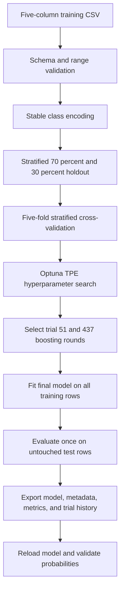
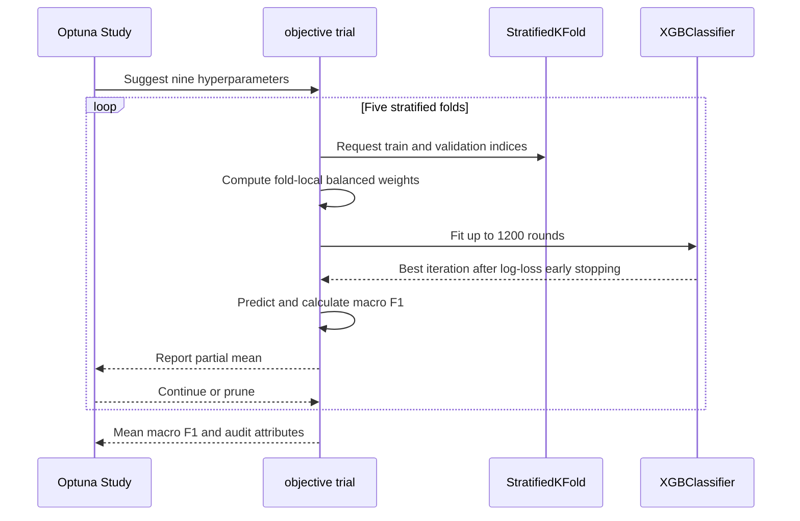

# Model Exploration and Training — Model Training

<show-structure for="chapter" depth="2"/>

<p>This chapter follows the model from the curated five-column dataset to a deployable XGBoost artifact. The authoritative implementation is <code>SDN-MPLS-ML-TechDemonstrator-Model-Training.ipynb</code>. The notebook is designed around a specific operational contract, infer a seven-class traffic label from the four fields that the controller can extract when the first packet reaches OpenDaylight.</p>

<p>The training design responds directly to the exploratory findings. HTTP and DNS account for almost all observations, while NTP has only 23 records. The notebook therefore reserves an untouched stratified test set, searches hyperparameters only inside the training partition, balances each fit through sample weights, and uses macro F1 as the Optuna objective.</p>

## From Dataset to Runtime Artifact {id="training-runtime-artifact"}



<p>The central methodological boundary is shown between model selection and final evaluation. The 30 percent test partition is not used to choose hyperparameters, stop boosting rounds, or calculate class weights. It is opened only after the final model has been fitted on the complete 70 percent training partition.</p>

<note>
<p>A hold-out set estimates performance only when it remains outside model selection. Repeatedly changing the model in response to the same test results would gradually turn that set into another validation set.</p>
</note>

## Runtime and Training Contract {id="training-runtime-contract"}

<p>The stored run records Python 3.13.13, pandas 3.0.5, NumPy 2.5.1, Matplotlib 3.11.1, seaborn 0.13.2, scikit-learn 1.9.0, XGBoost 3.3.0, and Optuna 4.9.0. It ran on an ARM64 macOS host with 16 detected logical processors and assigned 15 threads to XGBoost. The notebook uses a reproducibility seed of <code>42</code>, a 30 percent test share, five stratified folds, and 75 Optuna trials.</p>

| Contract element | Value | Effect |
|---|---|---|
| Input | `src/res/data/processed/SDNFlow_Training_Sample_Dataset.csv` | Consumes the EDA product |
| Input order | `eth_type`, `ip_proto`, `src_port`, `dst_port` | Defines the exact inference vector order |
| Target | `Category` | Seven-class supervised label |
| Class IDs | DNS 0, FTP 1, HTTP 2, ICMP 3, NTP 4, SSH 5, STREAMING 6 | Stable model and API mapping |
| Test split | 30 percent | Leaves 66,470 rows untouched for final evaluation |
| Cross-validation | 5 folds | Evaluates each trial across five stratified validation partitions |
| Search budget | 75 trials | Bounds hyperparameter optimization time |
| Maximum boosting rounds | 1,200 | Upper bound for each fold fit |
| Early-stopping patience | 50 rounds | Stops a fold when validation log loss ceases to improve |
| XGBoost execution | CPU, histogram tree method | Uses the local processor and approximate histogram splits |

<p>The configuration reserves one logical CPU when possible, runs Optuna trials sequentially, and allows each XGBoost fit to use the remaining threads. This arrangement avoids multiplying trial-level and estimator-level parallelism, which can oversubscribe a workstation.</p>

## Training Utility Layer {id="training-utility-layer"}

<p>The utility cell centralizes validation and estimator construction so that the optimization loop and final fit use the same model contract. Every implemented function is described below.</p>

<deflist type="full" collapsible="true">
<def title="normalize_category_series(series)">
<p>Converts labels to nullable strings, trims whitespace, uppercases values, and replaces textual null markers with <code>pd.NA</code>. It aligns the training labels with the seven-name class mapping.</p>
</def>
<def title="validate_configuration()">
<p>Rejects placeholder paths, missing or non-file inputs, invalid split fractions, fewer than two folds, and a nonpositive trial count. It creates model and figure directories only after the configuration passes.</p>
</def>
<def title="finalize_figure(name)">
<p>Applies tight layout, optionally writes a sanitized 180 DPI PNG, displays the figure, and closes it to release plotting resources.</p>
</def>
<def title="display_class_distribution(y, title)">
<p>Counts labels, calculates percentages and frequency rank, renders the table, and returns it for split metadata.</p>
</def>
<def title="validate_minority_support(y_train, n_splits)">
<p>Confirms that the smallest training class has at least one record available for every fold. It raises an error before optimization when stratified cross-validation is infeasible.</p>
</def>
<def title="build_feature_matrix(frame)">
<p>Selects the four features in canonical order and converts them to a <code>float32</code> NumPy matrix. Explicit ordering prevents the CSV column order from silently changing inference semantics.</p>
</def>
<def title="encode_target(series)">
<p>Maps normalized class names through <code>CLASS_TO_ID</code>, rejects any unmapped label, and returns an <code>int64</code> target vector.</p>
</def>
<def title="build_xgb_classifier(params, n_estimators, early_stopping_rounds)">
<p>Combines trial parameters with the fixed multiclass contract. It sets <code>multi:softprob</code>, seven classes, the histogram tree method, CPU execution, multiclass log loss, the common seed, the thread count, and optional early stopping.</p>
</def>
<def title="suggest_xgb_params(trial)">
<p>Defines the search distributions for depth, learning rate, minimum child weight, row and column subsampling, split gamma, L1 and L2 regularization, and maximum delta step.</p>
</def>
<def title="clean_params_for_final_training(best_params)">
<p>Returns a defensive copy of the selected Optuna parameters for final estimator construction.</p>
</def>
<def title="validate_probability_matrix(probabilities)">
<p>Requires a two-dimensional finite matrix with seven columns and row sums within <code>0.001</code> of one. This checks the output contract expected by the inference API.</p>
</def>
<def title="save_json(path, payload)">
<p>Creates the parent directory and serializes a human-readable UTF-8 JSON document with preserved non-ASCII characters.</p>
</def>
<def title="objective(trial)">
<p>Runs one complete five-fold candidate evaluation. It obtains parameters, calculates balanced weights from each fold's training labels, fits with early stopping, computes validation macro F1, reports partial means for pruning, records fold scores and best iterations, and returns the mean macro F1 for maximization.</p>
</def>
</deflist>

## Dataset Validation {id="training-dataset-validation"}

<p>The notebook loads the processed CSV after validating configuration and paths. It confirms that all five required columns exist, then selects exactly those columns. The target is normalized and every feature is converted with <code>pd.to_numeric</code>. Rows with missing values, out-of-range values, fractional protocol values, or unknown target labels would be removed and counted.</p>

<p>The executable validation path applies each rule as an explicit mask. This makes the removal reason measurable and ensures that integer conversion occurs only after missing, range, and integral-value checks have completed.</p>

```python
df_raw = pd.read_csv(DATA_PATH, sep=CSV_SEPARATOR, encoding=CSV_ENCODING)
df = df_raw[TRAINING_COLUMNS].copy()
df[TARGET_COLUMN] = normalize_category_series(df[TARGET_COLUMN])

for feature in FEATURE_COLUMNS:
    df[feature] = pd.to_numeric(df[feature], errors="coerce")

missing_mask = df[TRAINING_COLUMNS].isna().any(axis=1)
df = df.loc[~missing_mask].copy()

range_mask = pd.Series(False, index=df.index)
for feature, bounds in FEATURE_RULES.items():
    range_mask |= df[feature].lt(bounds["min"]) | df[feature].gt(bounds["max"])
df = df.loc[~range_mask].copy()

non_integral_mask = pd.Series(False, index=df.index)
for feature in FEATURE_COLUMNS:
    non_integral_mask |= ~np.isclose(df[feature] % 1, 0)
df = df.loc[~non_integral_mask].copy()

for feature in FEATURE_COLUMNS:
    df[feature] = df[feature].astype("Int64")

invalid_target_mask = ~df[TARGET_COLUMN].isin(EXPECTED_CLASSES)
df = df.loc[~invalid_target_mask].reset_index(drop=True)
```

| Validation outcome | Removed rows |
|---|---:|
| Missing selected feature or target | 0 |
| Feature outside its allowed range | 0 |
| Nonintegral selected feature | 0 |
| Target outside the expected classes | 0 |

<p>The resulting training table has 221,564 rows and five columns. Each feature uses nullable <code>Int64</code>, and the target uses pandas <code>string</code>. These results independently confirm the EDA export contract before model fitting begins.</p>

## Why Accuracy Is Not the Objective {id="training-why-macro-f1"}

<p>The cleaned class distribution remains unchanged, with HTTP at 164,974 records and NTP at 23. The majority-to-minority ratio is 7,172.78 to 1. Under this imbalance, overall accuracy is dominated by HTTP and DNS.</p>

<p>For one class, precision is <code>TP / (TP + FP)</code>, recall is <code>TP / (TP + FN)</code>, and F1 is their harmonic mean.</p>

```text
F1 = 2 * precision * recall / (precision + recall)
   = 2 * TP / (2 * TP + FP + FN)
```

<p>Macro F1 computes F1 independently for each of the seven classes and takes their unweighted mean. Each class therefore contributes one seventh of the objective regardless of prevalence. Weighted F1 instead weights each class by support and consequently follows the dominant classes more closely. The <a href="https://scikit-learn.org/stable/modules/model_evaluation.html">scikit-learn model evaluation guide</a> describes these averaging choices.</p>

<tip>
<p>Macro F1 does not manufacture minority evidence. It prevents the optimizer from ignoring rare classes, but NTP performance remains uncertain because the dataset supplies very few NTP examples.</p>
</tip>

## Stratified Hold-Out Design {id="training-stratified-holdout"}

<p>The notebook builds <code>X</code> with shape 221,564 by 4 and <code>y</code> with length 221,564. It then calls <code>train_test_split</code> with <code>stratify=y</code>, <code>test_size=0.30</code>, and the fixed random state. Stratification preserves class proportions as closely as integer counts permit.</p>

```python
X = build_feature_matrix(df)
y = encode_target(df[TARGET_COLUMN])
y_names = df[TARGET_COLUMN].copy()

X_train, X_test, y_train, y_test, y_train_names, y_test_names = (
    train_test_split(
        X,
        y,
        y_names,
        test_size=TEST_SIZE,
        random_state=RANDOM_STATE,
        stratify=y,
    )
)
```

| Class | Training records | Training share | Test records | Test share |
|---|---:|---:|---:|---:|
| HTTP | 115,481 | 74.458715 percent | 49,493 | 74.459155 percent |
| DNS | 37,486 | 24.169858 percent | 16,065 | 24.168798 percent |
| STREAMING | 1,041 | 0.671206 percent | 446 | 0.670979 percent |
| SSH | 793 | 0.511303 percent | 340 | 0.511509 percent |
| ICMP | 213 | 0.137336 percent | 92 | 0.138408 percent |
| FTP | 64 | 0.041265 percent | 27 | 0.040620 percent |
| NTP | 16 | 0.010316 percent | 7 | 0.010531 percent |

<p>The smallest training class has 16 records, which is greater than the five-fold count. The feasibility guard therefore permits <code>StratifiedKFold</code>. The split configuration and both distributions are exported to <code>sdn_mpls_ml_train_test_split_summary.json</code>.</p>

<note>
<p>Stratification solves the engineering problem of folds that omit a rare class. It does not make the folds statistically independent and it does not increase minority support. See the <a href="https://scikit-learn.org/stable/modules/cross_validation.html">scikit-learn cross-validation guide</a>.</p>
</note>

## Balanced Sample Weights {id="training-balanced-weights"}

<p>Each fold calculates weights only from its own training labels. For class <code>c</code>, scikit-learn's balanced rule is:</p>

```text
w_c = n_samples / (n_classes * n_samples_in_class_c)
```

<p>Every sample inherits its class weight. Rare-class mistakes consequently contribute more to the training objective, while common-class samples contribute less individually. Calculating weights inside each fold avoids using validation-label frequencies during fitting. The final fit recalculates weights from the complete 70 percent training partition.</p>

```python
sample_weights = compute_sample_weight(
    class_weight="balanced",
    y=y_fold_train,
)

model.fit(
    X_fold_train,
    y_fold_train,
    sample_weight=sample_weights,
    eval_set=[(X_fold_valid, y_fold_valid)],
    verbose=False,
)
```

<p>The <a href="https://scikit-learn.org/stable/modules/generated/sklearn.utils.class_weight.compute_sample_weight.html">compute_sample_weight reference</a> defines this inverse-frequency rule.</p>

## XGBoost Model {id="training-xgboost-model"}

<p>XGBoost builds an additive ensemble of decision trees. At boosting round <code>t</code>, a new tree is chosen to reduce a regularized approximation of the current loss. For multiclass prediction, the ensemble produces one score per class and <code>multi:softprob</code> transforms those scores into a probability vector.</p>

<p>The notebook uses multiclass log loss for early stopping within each fold. Macro F1 remains the outer Optuna objective. This separation lets XGBoost monitor a smooth probability-based loss during boosting while Optuna selects parameter sets according to the class-balanced operational metric.</p>

<p>The histogram tree method groups continuous candidate values into bins before searching for splits. With only four input features and CPU execution, it offers an efficient fit while preserving the nonlinear partitioning needed for protocol and port combinations. The <a href="https://xgboost.readthedocs.io/en/stable/parameter.html">XGBoost parameter reference</a> documents <code>hist</code>, <code>multi:softprob</code>, and the regularization parameters used here.</p>

## Hyperparameter Search Space {id="training-hyperparameter-space"}

| Parameter | Search range | Scale | Model effect |
|---|---:|---|---|
| `max_depth` | 2 to 8 | Integer | Limits interaction depth and tree complexity |
| `learning_rate` | 0.01 to 0.25 | Logarithmic | Shrinks each tree's contribution |
| `min_child_weight` | 1 to 30 | Logarithmic | Requires sufficient second-order weight in a child |
| `subsample` | 0.60 to 1.00 | Linear | Samples rows per boosting round |
| `colsample_bytree` | 0.70 to 1.00 | Linear | Samples the four features per tree |
| `gamma` | 0 to 10 | Linear | Requires minimum loss reduction for a split |
| `reg_alpha` | 0.00000001 to 10 | Logarithmic | Applies L1 regularization |
| `reg_lambda` | 0.001 to 100 | Logarithmic | Applies L2 regularization |
| `max_delta_step` | 0 to 10 | Linear | Bounds leaf-score updates |

<p>Depth is kept moderate because only four features exist. Row and column subsampling add stochastic regularization. Gamma, minimum child weight, and L1 and L2 penalties make weak or overly specific branches less attractive. Maximum delta step provides another control over extreme updates under strong weighting.</p>

## Optuna Search and Fold Loop {id="training-optuna-search"}

<p>The study maximizes macro F1 with a seeded multivariate Tree-structured Parzen Estimator. TPE separates parameter observations associated with stronger objective values from the remainder, models both groups, and proposes candidates that favor the promising density. The multivariate option allows joint parameter relationships to influence suggestions.</p>

<p>A median pruner is configured with 10 startup trials and two warm-up steps. After each fold, <code>objective</code> reports the mean macro F1 observed so far. Once pruning is active, a trial whose intermediate performance is unpromising relative to completed trials can stop before all five fits are executed. Optuna's <a href="https://optuna.readthedocs.io/en/stable/reference/generated/optuna.pruners.MedianPruner.html">MedianPruner reference</a> defines this stopping rule, and its <a href="https://optuna.readthedocs.io/en/stable/reference/samplers/generated/optuna.samplers.TPESampler.html">TPESampler reference</a> describes the density-ratio search.</p>

<p>The core of each trial is the fold loop below. This is where the candidate is actually trained, scored, reported, and potentially pruned. The hold-out test partition is absent from this path.</p>

```python
fold_scores = []
fold_best_iterations = []

for fold_index, (train_index, valid_index) in enumerate(
    cv.split(X_train, y_train),
    start=1,
):
    X_fold_train = X_train[train_index]
    X_fold_valid = X_train[valid_index]
    y_fold_train = y_train[train_index]
    y_fold_valid = y_train[valid_index]

    sample_weights = compute_sample_weight("balanced", y_fold_train)
    model = build_xgb_classifier(
        params=params,
        n_estimators=MAX_BOOSTING_ROUNDS,
        early_stopping_rounds=EARLY_STOPPING_ROUNDS,
    )
    model.fit(
        X_fold_train,
        y_fold_train,
        sample_weight=sample_weights,
        eval_set=[(X_fold_valid, y_fold_valid)],
        verbose=False,
    )

    y_fold_pred = model.predict(X_fold_valid)
    fold_scores.append(
        f1_score(y_fold_valid, y_fold_pred, average="macro", zero_division=0)
    )
    fold_best_iterations.append(int(model.best_iteration) + 1)
    trial.report(float(np.mean(fold_scores)), step=fold_index)

    if trial.should_prune():
        raise optuna.TrialPruned()
```

<note>
<p>The stored run emits an Optuna warning that multivariate TPE is experimental. The selected configuration is valid for the recorded Optuna version, but a future dependency upgrade should verify that the option and its behavior remain compatible.</p>
</note>

<p>The study configuration and optimization call establish the reproducible search policy around that fold loop.</p>

```python
sampler = optuna.samplers.TPESampler(
    seed=RANDOM_STATE,
    multivariate=True,
)
pruner = optuna.pruners.MedianPruner(
    n_startup_trials=10,
    n_warmup_steps=2,
)
study = optuna.create_study(
    study_name=OPTUNA_STUDY_NAME,
    direction="maximize",
    sampler=sampler,
    pruner=pruner,
    storage=OPTUNA_STORAGE,
    load_if_exists=False,
)
study.optimize(
    objective,
    n_trials=N_OPTUNA_TRIALS,
    n_jobs=OPTUNA_N_JOBS,
    show_progress_bar=True,
)
```



<p>The executed search evaluated 75 trials in 1,245.43 seconds, or 20.76 minutes. Forty-five trials completed and 30 were pruned. Among completed trials, macro F1 ranged from 0.876411 to 0.892986, with a median of 0.886059.</p>

## Selected Trial {id="training-selected-trial"}

<p>Trial 51 achieved the highest cross-validation macro F1, <code>0.8929864596</code>. Its fold scores and early-stopping points show the variation hidden by the mean.</p>

| Fold | Macro F1 | Best boosting rounds |
|---:|---:|---:|
| 1 | 0.880576 | 548 |
| 2 | 0.900725 | 318 |
| 3 | 0.904051 | 437 |
| 4 | 0.901183 | 309 |
| 5 | 0.878397 | 475 |

<p>The standard deviation across folds is <code>0.012413</code>. The median best iteration is 437, which becomes the fixed number of estimators for the final model. Taking the median avoids creating another validation split and is less sensitive to one unusually early or late fold.</p>

| Selected parameter | Value |
|---|---:|
| `max_depth` | 3 |
| `learning_rate` | 0.2372833091 |
| `min_child_weight` | 2.6879996018 |
| `subsample` | 0.7592168054 |
| `colsample_bytree` | 0.7137871020 |
| `gamma` | 0.2018705981 |
| `reg_alpha` | 0.1073840468 |
| `reg_lambda` | 0.0057276986 |
| `max_delta_step` | 4.1479874702 |

<p>The study table is exported to <code>sdn_mpls_mp_optuna_trials.csv</code>. Two figures describe completed-trial macro F1 over trial number and the cumulative best value, which separates local trial variation from actual improvement of the incumbent solution.</p>

## Final Fit {id="training-final-fit"}

<p>The final estimator is reconstructed with trial 51 parameters and 437 trees. Balanced sample weights are recomputed from all 155,094 training labels. Early stopping is disabled because there is no longer a validation partition inside the training share, and the test share remains sealed. The fit completes in 2.59 seconds in the stored environment.</p>

```python
best_params = clean_params_for_final_training(study.best_params)
final_n_estimators = int(
    study.best_trial.user_attrs["median_best_iteration"]
)
final_n_estimators = max(
    1,
    min(final_n_estimators, MAX_BOOSTING_ROUNDS),
)
final_sample_weights = compute_sample_weight(
    class_weight="balanced",
    y=y_train,
)

final_model = build_xgb_classifier(
    params=best_params,
    n_estimators=final_n_estimators,
    early_stopping_rounds=None,
)
final_model.fit(
    X_train,
    y_train,
    sample_weight=final_sample_weights,
    verbose=True,
)
```

<note>
<p>The short final fit should not be compared directly with the 20.76 minute search. Optimization performs hundreds of fold fits across candidate parameter sets, while the final stage performs one fit with a known tree count.</p>
</note>

## Probability Validation {id="training-probability-validation"}

<p>The final model produces a 66,470 by 7 probability matrix over the test set. The notebook checks shape, finiteness, class count, and approximate unit row sums before deriving predictions with <code>argmax</code>. Mean maximum confidence is 0.999763 and median maximum confidence is 0.999942.</p>

```python
test_probabilities = final_model.predict_proba(X_test)
validate_probability_matrix(test_probabilities)

y_test_pred = np.argmax(test_probabilities, axis=1)
test_confidence = np.max(test_probabilities, axis=1)
```

<warning>
<p>High maximum probability is not proof of calibration. The notebook validates the probability contract but does not calculate reliability curves, expected calibration error, Brier score, or log loss on the hold-out set. The confidence values should therefore be read as model scores, not as demonstrated frequencies of correctness.</p>
</warning>

## Final Hold-Out Results {id="training-holdout-results"}

| Metric | Result | Reading |
|---|---:|---|
| Accuracy | 0.999654 | Dominated by the two largest classes |
| Macro F1 | 0.879647 | Gives every class equal influence |
| Weighted F1 | 0.999723 | Closely follows the majority-class result |

```python
final_accuracy = accuracy_score(y_test, y_test_pred)
final_macro_f1 = f1_score(
    y_test,
    y_test_pred,
    average="macro",
    zero_division=0,
)
final_weighted_f1 = f1_score(
    y_test,
    y_test_pred,
    average="weighted",
    zero_division=0,
)

report_dict = classification_report(
    y_test,
    y_test_pred,
    labels=list(range(len(EXPECTED_CLASSES))),
    target_names=EXPECTED_CLASSES,
    zero_division=0,
    output_dict=True,
)
```

<p>The gap between weighted and macro F1 is the most important aggregate result. It confirms that excellent performance on high-support classes coexists with a serious minority-class weakness.</p>

| Class | Precision | Recall | F1 | Test support |
|---|---:|---:|---:|---:|
| DNS | 1.000000 | 1.000000 | 1.000000 | 16,065 |
| FTP | 1.000000 | 1.000000 | 1.000000 | 27 |
| HTTP | 0.999899 | 0.999636 | 0.999768 | 49,493 |
| ICMP | 1.000000 | 1.000000 | 1.000000 | 92 |
| NTP | 0.111111 | 0.285714 | 0.160000 | 7 |
| SSH | 1.000000 | 1.000000 | 1.000000 | 340 |
| STREAMING | 0.995536 | 1.000000 | 0.997763 | 446 |

<p>DNS, FTP, ICMP, SSH, and STREAMING have no false negatives in this test partition. HTTP has 18 errors among 49,493 observations. NTP has only two correct predictions among seven observations. Its low precision also reflects HTTP records predicted as NTP.</p>

## Confusion Structure {id="training-confusion-structure"}

| True class | Predicted class | Count |
|---|---|---:|
| HTTP | NTP | 16 |
| NTP | HTTP | 5 |
| HTTP | STREAMING | 2 |

<p>These are all 23 test errors. The normalized confusion matrix gives NTP a recall of 0.285714 because two of seven NTP records are correct, while five are classified as HTTP. HTTP recall remains 0.999636 because the same absolute number of mistakes is negligible against 49,493 HTTP observations.</p>

```python
cm = confusion_matrix(
    y_test,
    y_test_pred,
    labels=list(range(len(EXPECTED_CLASSES))),
)
cm_df = pd.DataFrame(
    cm,
    index=EXPECTED_CLASSES,
    columns=EXPECTED_CLASSES,
)

plt.figure(figsize=(10, 8))
sns.heatmap(cm_df, annot=True, fmt="d", cmap="Blues")
plt.xlabel("Prediction")
plt.ylabel("True class")
finalize_figure("05_confusion_matrix_absolute")
```

<warning>
<p>The perfect FTP result is based on 27 test records, and the perfect NTP result was not achieved. Per-class support must always accompany the score. A value of one from a small partition is weaker evidence than the same value from thousands of independent observations.</p>
</warning>

## Feature Importance {id="training-feature-importance"}

<p>The notebook extracts two native tree importance measures. Gain is the average improvement associated with splits using a feature, while weight is the number of times the feature appears in splits.</p>

```python
booster = final_model.get_booster()
importance_gain = booster.get_score(importance_type="gain")
importance_weight = booster.get_score(importance_type="weight")

importance_rows = []
for feature_index, feature_name in enumerate(FEATURE_COLUMNS):
    xgb_feature_name = f"f{feature_index}"
    importance_rows.append(
        {
            "feature": feature_name,
            "gain": float(importance_gain.get(xgb_feature_name, 0.0)),
            "weight": float(importance_weight.get(xgb_feature_name, 0.0)),
        }
    )

importance_df = pd.DataFrame(importance_rows).sort_values(
    "gain",
    ascending=False,
)
```

| Feature | Gain | Split count |
|---|---:|---:|
| `ip_proto` | 944.123108 | 224 |
| `dst_port` | 520.132996 | 737 |
| `src_port` | 263.096802 | 1,752 |
| `eth_type` | 0.000000 | 0 |

<p><code>ip_proto</code> creates the largest average improvement, consistent with its ability to isolate ICMP and divide TCP from UDP. <code>src_port</code> is used most often, but its average gain is lower. <code>eth_type</code> is never selected because the EDA established that it is constant at IPv4 value 2,048.</p>

<note>
<p>Native gain and split count are model-specific diagnostics. They do not prove causality, and they can distribute credit unevenly among correlated or substitutable features. The notebook does not compute permutation importance or SHAP values.</p>
</note>

## Export and Reload Contract {id="training-export-reload"}

<p>The final section writes four complementary artifacts. The native XGBoost model contains the learned trees. Metadata defines how to construct a valid input vector and decode its output. Metrics preserve evaluation evidence. The trial CSV preserves the optimization history.</p>

| Artifact | Purpose |
|---|---|
| `src/res/models/sdn_mpls_ml_model.json` | Native XGBoost booster model used by inference |
| `src/res/models/sdn_mpls_ml_model_meta.json` | Schema version, model name, feature order, class maps, training plan, selected parameters, and best CV result |
| `src/res/models/sdn_mpls_ml_final_metrics.json` | Split, optimization, fit timing, aggregate metrics, class report, confusion matrices, and importance |
| `src/res/models/sdn_mpls_mp_optuna_trials.csv` | One row per completed or pruned Optuna trial |
| `src/res/models/sdn_mpls_ml_train_test_split_summary.json` | Reproducible hold-out sizes and class distributions |

<p>The model metadata names the artifact <code>sdnflow_xgboost_first_packet</code>, declares schema version <code>1.0</code>, records the JSON booster format, and publishes the four-feature order and seven-class mapping. This sidecar is essential because a model file alone cannot explain which numeric column occupies each position.</p>

<p>The notebook closes the pipeline by loading the exported JSON into a new <code>XGBClassifier</code>, predicting probabilities for the first ten test rows, and applying the same probability validation. The stored output reports <code>Validacion de carga del modelo exportado: correcta</code>, which proves that serialization did not prevent immediate reuse.</p>

```python
final_model.save_model(model_output_path)
save_json(metadata_output_path, model_metadata)
save_json(metrics_output_path, final_metrics)

loaded_model = XGBClassifier()
loaded_model.load_model(model_output_path)

loaded_probabilities = loaded_model.predict_proba(X_test[:10])
validate_probability_matrix(loaded_probabilities)
```

## What the Results Establish {id="training-results-meaning"}

<p>The model demonstrates that protocol and bidirectional port structure can classify most traffic in this controlled SDNFlow-derived problem with very high observed accuracy. It also demonstrates why aggregate success cannot be the only acceptance criterion. NTP remains poorly learned, EtherType contributes no information in an IPv4-only source, and probability calibration has not been measured.</p>

<p>Operational use should preserve the metadata feature order, monitor class-specific outcomes, and treat low-support classes as candidates for additional data collection. A future validation should also group related flow directions or capture sessions before splitting if the source contains correlated records from the same exchange. Row-level stratification preserves class ratios, but it does not guarantee that related flows are separated across train and test partitions.</p>

<tip>
<p>The strongest next experiment is not a larger hyperparameter search. It is a stronger evidence design, especially more NTP records, independent captures, grouped splitting where session identity is available, and explicit probability calibration.</p>
</tip>

## Conceptual References {id="training-conceptual-references"}

<deflist type="wide">
<def title="XGBoost objectives and tree parameters">
<p>The <a href="https://xgboost.readthedocs.io/en/stable/parameter.html">official XGBoost parameter documentation</a> defines the multiclass probability objective, histogram tree method, sampling controls, and regularization terms used by the notebook.</p>
</def>
<def title="XGBoost early stopping">
<p>The <a href="https://xgboost.readthedocs.io/en/stable/python/python_api.html">official XGBoost Python API</a> explains validation sets, early-stopping rounds, and the <code>best_iteration</code> attribute collected in each fold.</p>
</def>
<def title="Stratified validation">
<p>The <a href="https://scikit-learn.org/stable/modules/cross_validation.html">scikit-learn cross-validation guide</a> explains why stratified splits approximately preserve class proportions.</p>
</def>
<def title="F1 and multiclass averaging">
<p>The <a href="https://scikit-learn.org/stable/modules/model_evaluation.html">scikit-learn model evaluation guide</a> defines precision, recall, F1, macro averaging, and weighted averaging.</p>
</def>
<def title="Balanced sample weights">
<p>The <a href="https://scikit-learn.org/stable/modules/generated/sklearn.utils.class_weight.compute_sample_weight.html">scikit-learn sample-weight reference</a> defines inverse-frequency balanced weighting.</p>
</def>
<def title="Optuna TPE and pruning">
<p>The official Optuna references for <a href="https://optuna.readthedocs.io/en/stable/reference/samplers/generated/optuna.samplers.TPESampler.html">TPESampler</a> and <a href="https://optuna.readthedocs.io/en/stable/reference/generated/optuna.pruners.MedianPruner.html">MedianPruner</a> describe candidate generation and intermediate-value pruning.</p>
</def>
</deflist>
