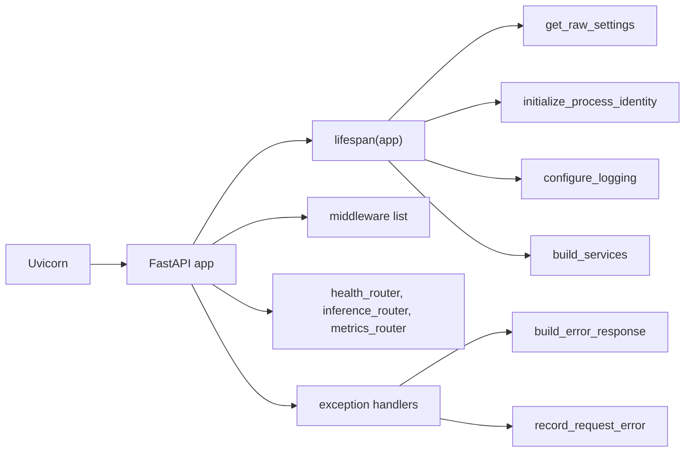
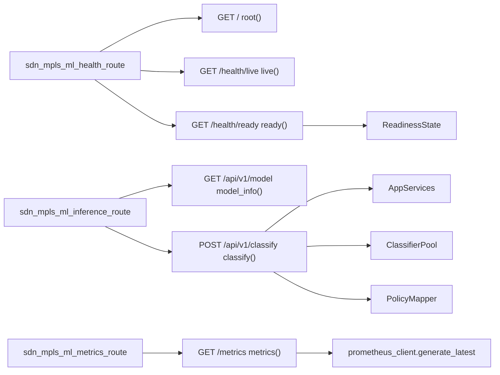
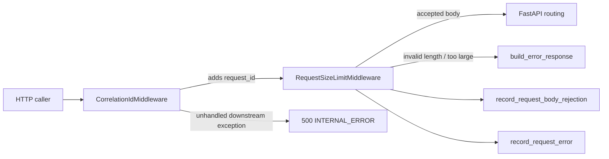
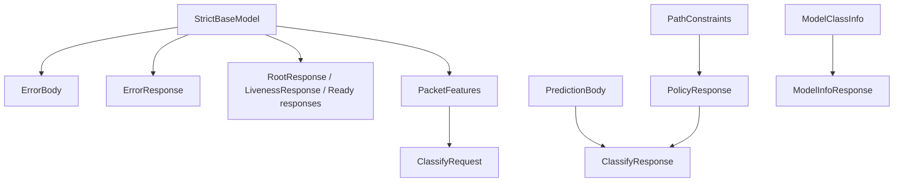
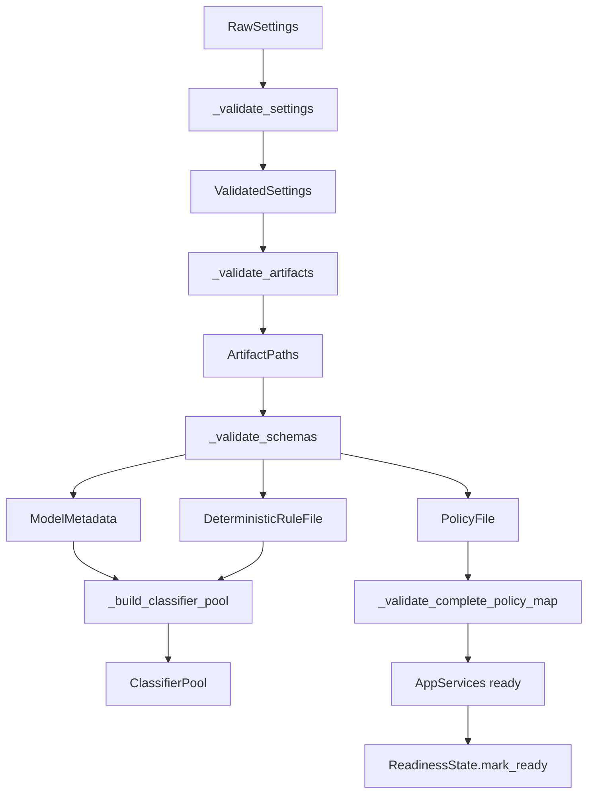
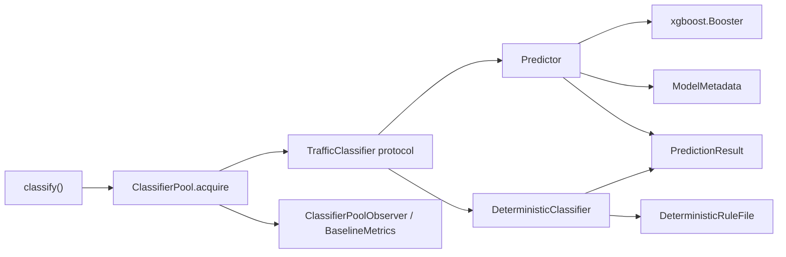
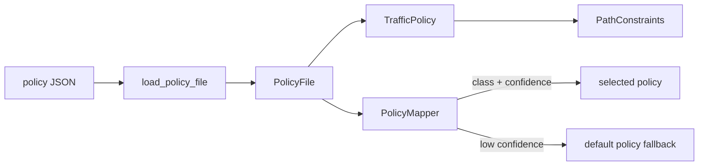
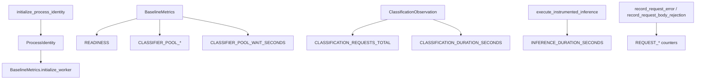
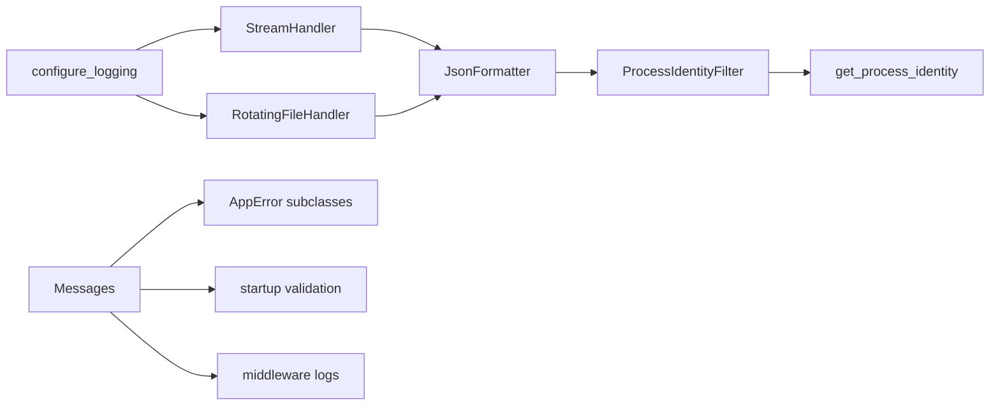
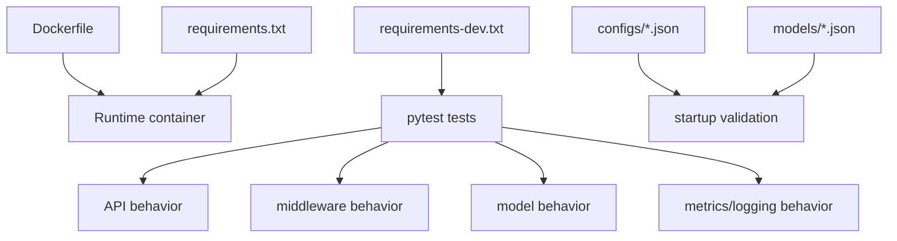

# Python API Per-Module Component Diagram Snippets

Each section contains a standalone Mermaid snippet that can be embedded directly in Writerside.

## Application Main

## API Routes

## Middleware

## Schemas

## Startup Dependencies

## Model Runtime

## Policy

## Observability

## Logging And Messages

## Artifacts And Tests

