# Python API Per-Class Mermaid Diagram Snippets

These snippets are intentionally small and class-specific so they can be pasted into individual Writerside sections.

## Configuration Classes

### ClassificationMode

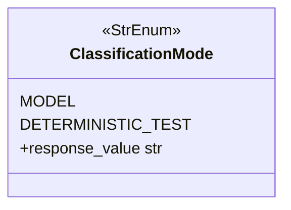

### RawSettings

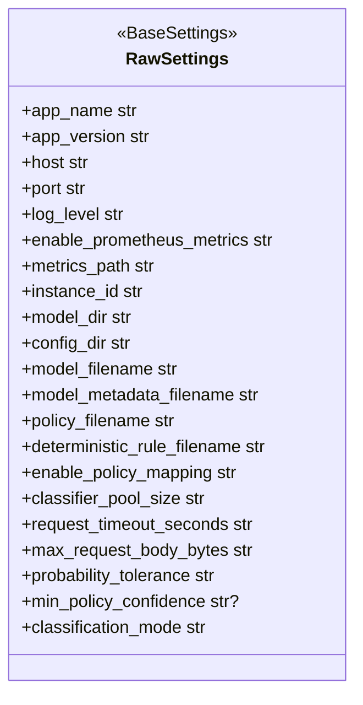

### ValidatedSettings

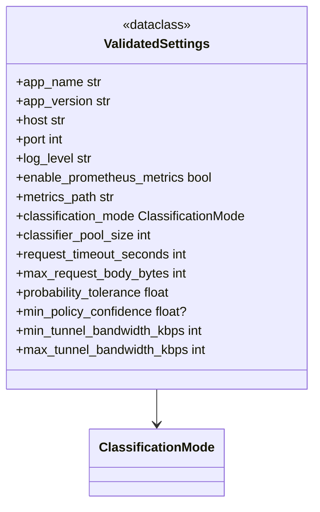

## Startup And Readiness Classes

### ArtifactPaths

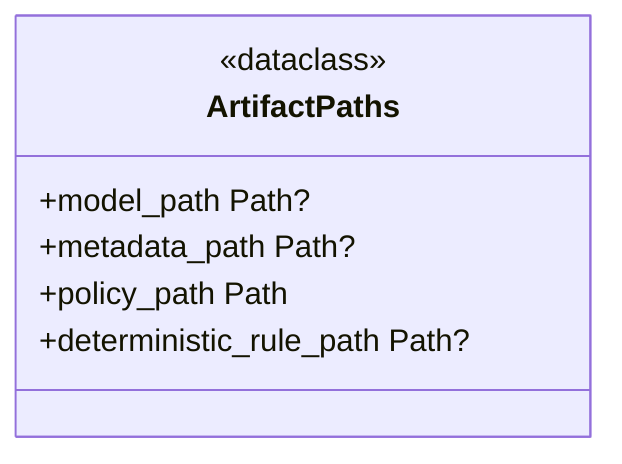

### AppServices

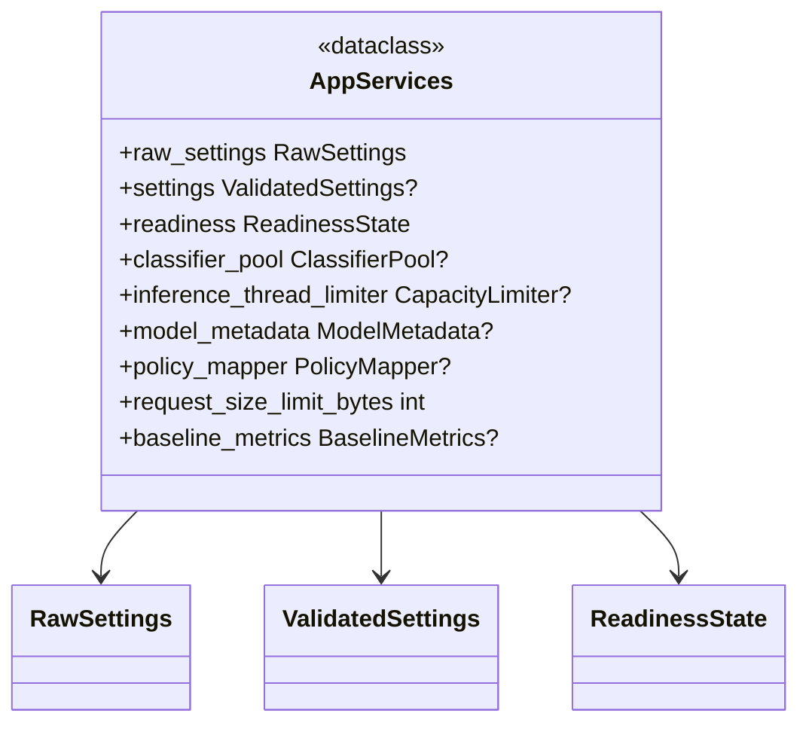

### StartupValidationError

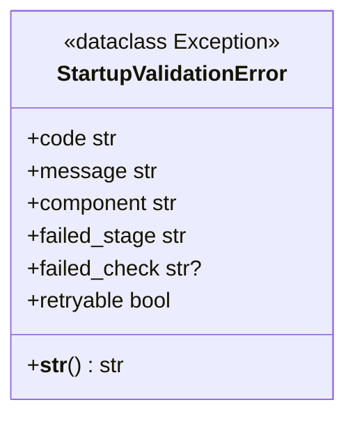

### ReadinessState

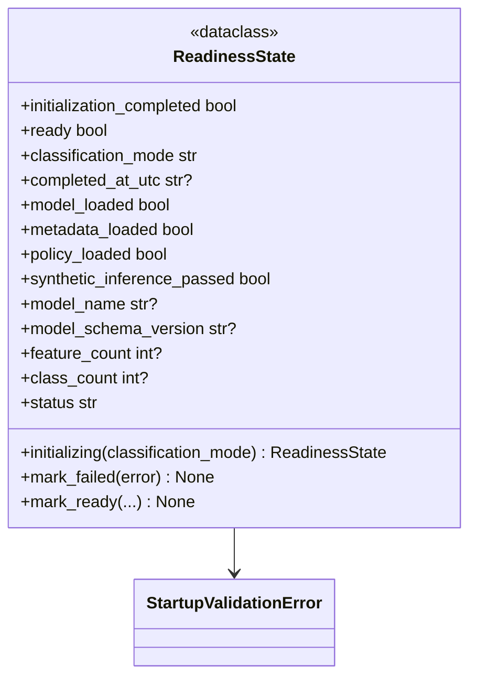

## Error Classes

### ErrorDetail

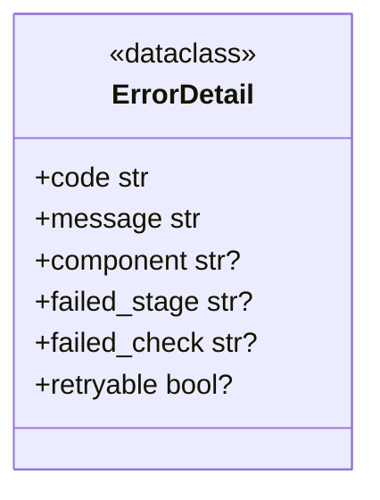

### AppError And Subclasses

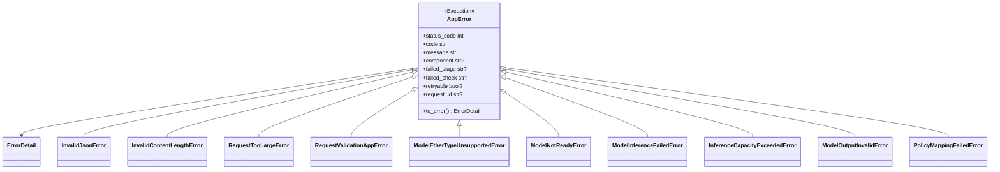

## Middleware Classes

### CorrelationIdMiddleware

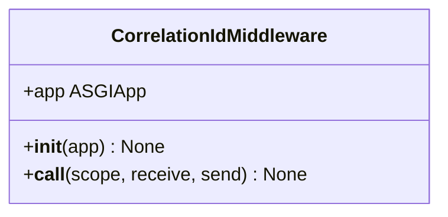

### RequestSizeLimitMiddleware

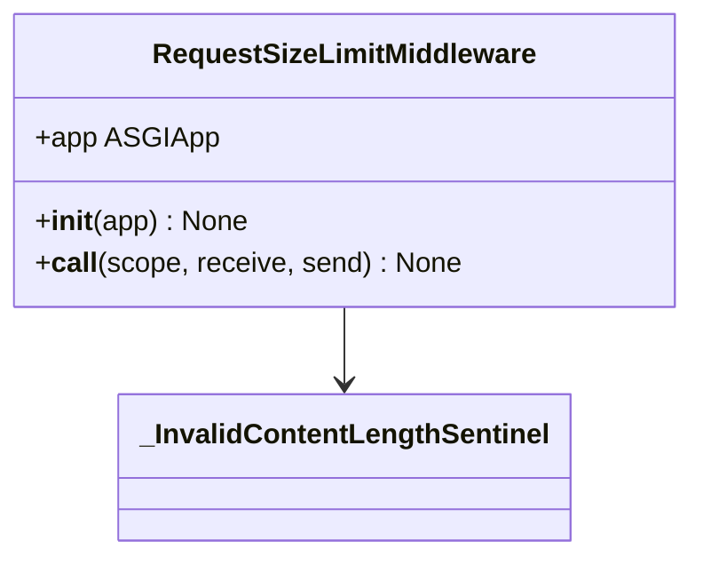

## HTTP Schema Classes

### Base Error Schemas

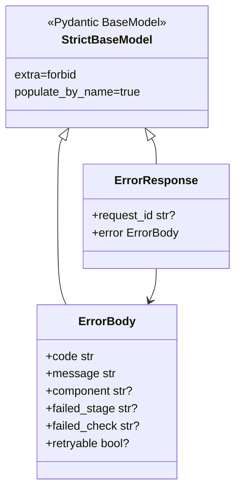

### Health Schemas

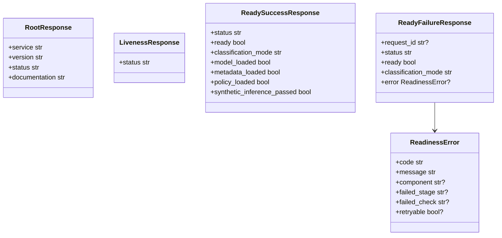

### Inference Schemas

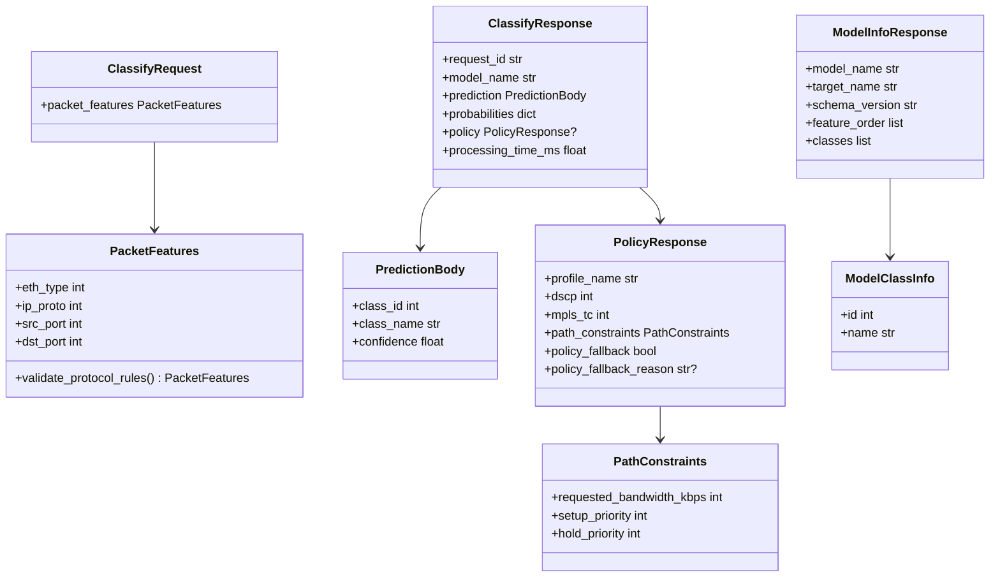

## Model Classes

### ClassifierPoolObserver

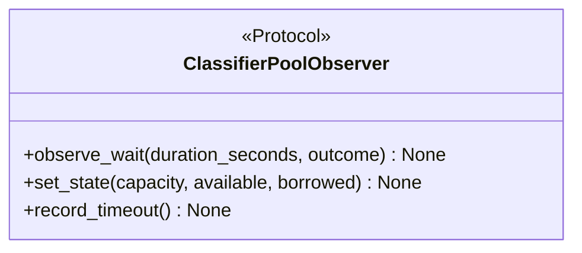

### ClassifierPool

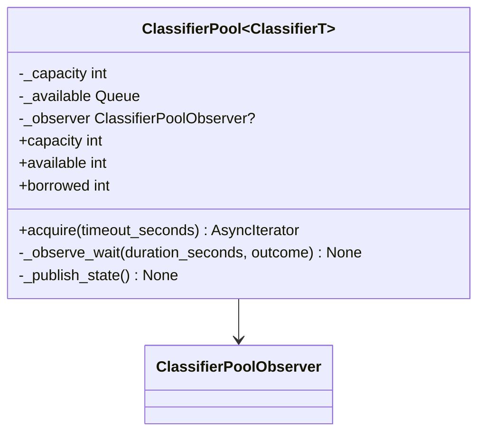

### TrafficClassifier

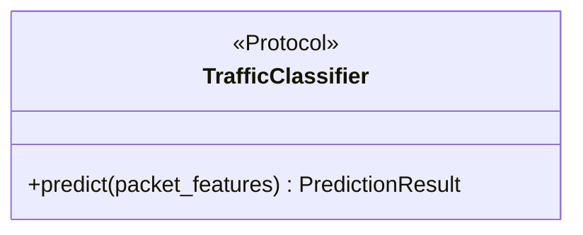

### PredictionResult

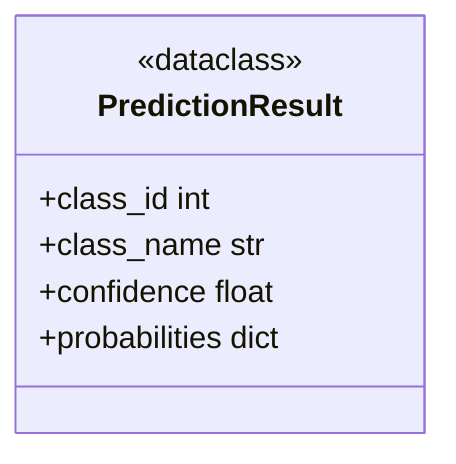

### Predictor

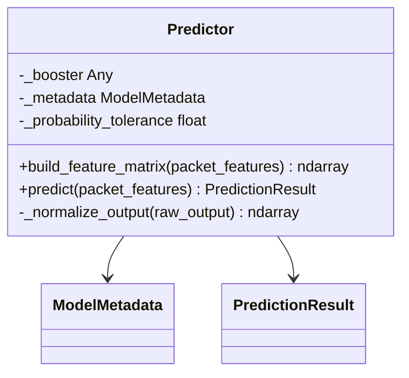

### DeterministicClassifier

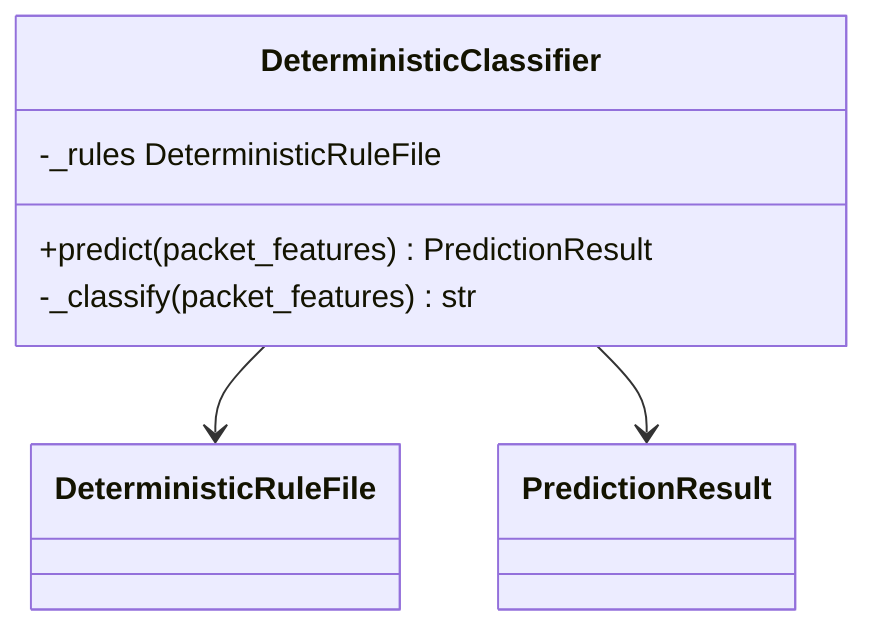

### DeterministicRuleFile

```mermaid
classDiagram
    class DeterministicRuleFile {
        <<Pydantic BaseModel>>
        +schema_version str
        +well_known_port_threshold int
        +icmp_ip_protocol int
        +destination_port_class_map dict
        +source_port_class_map dict
        +streaming_class_name str
        +validate_port_map_keys(value) dict
        +validate_contract() DeterministicRuleFile
    }
```

### ModelMetadata

```mermaid
classDiagram
    class ModelMetadata {
        <<Pydantic BaseModel>>
        +schema_version str
        +model_name str
        +target_name str
        +model_format str
        +feature_order list
        +feature_types dict
        +class_to_id dict
        +id_to_class dict
        +validate_schema_version(value) str
        +validate_contract() ModelMetadata
        +classes list
    }
```

## Policy Classes

### Policy Artifact Schemas

```mermaid
classDiagram
    class PolicyPathConstraints {
        +requested_bandwidth_kbps int
        +setup_priority int
        +hold_priority int
    }
    class TrafficPolicy {
        +profile_name str
        +dscp int
        +mpls_tc int
        +path_constraints PolicyPathConstraints
        +validate_profile_name(value) str
    }
    class PolicyFile {
        +schema_version str
        +default_profile TrafficPolicy
        +class_policies dict
        +validate_schema_version(value) str
    }
    TrafficPolicy --> PolicyPathConstraints
    PolicyFile --> TrafficPolicy
```

### PolicyMapper

```mermaid
classDiagram
    class PolicyMapper {
        -_policy_file PolicyFile
        -_min_policy_confidence float?
        +resolve(predicted_class, confidence) tuple
        +default_policy TrafficPolicy
    }
    PolicyMapper --> PolicyFile
    PolicyMapper --> TrafficPolicy
```

## Observability Classes

### ProcessIdentity

```mermaid
classDiagram
    class ProcessIdentity {
        <<dataclass frozen>>
        +service str
        +instance_id str
        +worker_id str
        +worker_pid int
        +process_name str
        +started_at_unix_seconds float
    }
```

### BaselineMetrics

```mermaid
classDiagram
    class BaselineMetrics {
        <<dataclass>>
        +classification_mode str
        +initialize_worker(identity) None
        +set_readiness(ready) None
        +set_pool_state(capacity, available, borrowed) None
        +set_state(capacity, available, borrowed) None
        +observe_wait(duration_seconds, outcome) None
        +record_timeout() None
    }
    BaselineMetrics --> ProcessIdentity
```

### ClassificationObservation

```mermaid
classDiagram
    class ClassificationObservation {
        <<dataclass>>
        +classification_mode str
        +enabled bool
        +started_at float
        +outcome str
        +completed bool
        +mark_outcome(outcome) None
        +finish() None
    }
```

## Logging And Message Classes

### ProcessIdentityFilter

```mermaid
classDiagram
    class ProcessIdentityFilter {
        +filter(record) bool
    }
    ProcessIdentityFilter --> ProcessIdentity
```

### JsonFormatter

```mermaid
classDiagram
    class JsonFormatter {
        +format(record) str
    }
```

### Messages

```mermaid
classDiagram
    class Messages {
        <<constants>>
        +artifact_path_resolution(configured_filename) str
        +artifact_not_found(configured_filename) str
        +artifact_not_regular_file(configured_filename) str
        +artifact_not_readable(configured_filename) str
        +artifact_empty(configured_filename) str
        +artifact_not_utf8(configured_filename) str
        +policy_file_validation_failed(details) str
        +unexpected_model_name(actual) str
        +policy_bandwidth_below_minimum(class_name) str
        +policy_bandwidth_above_maximum(class_name) str
    }
```
